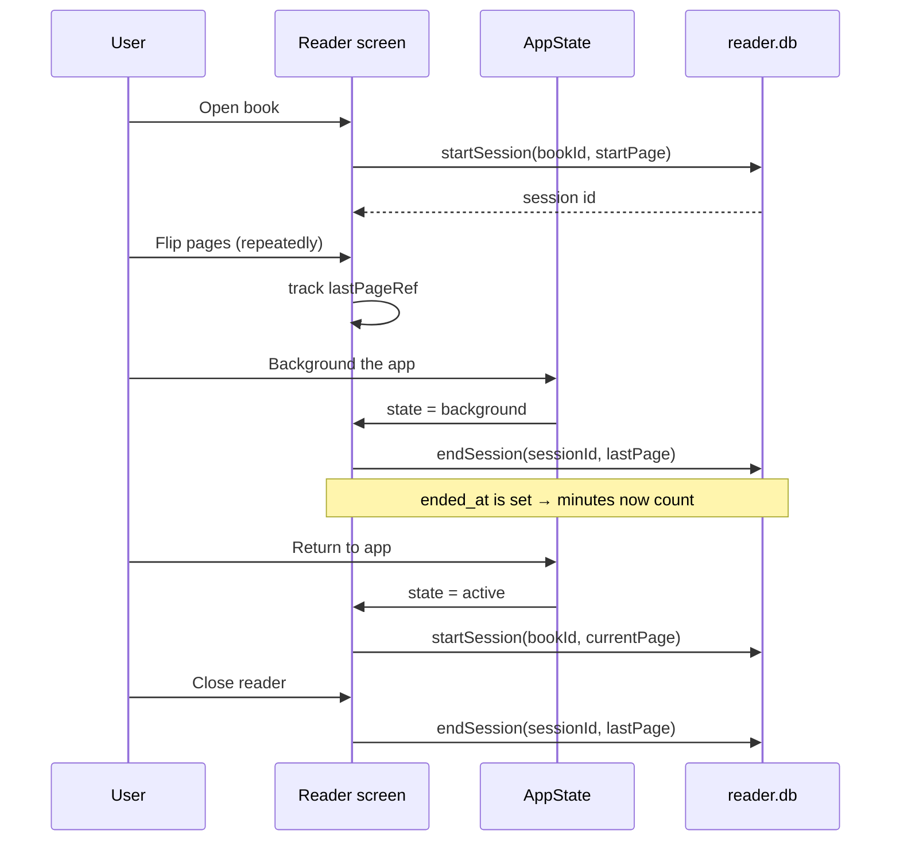
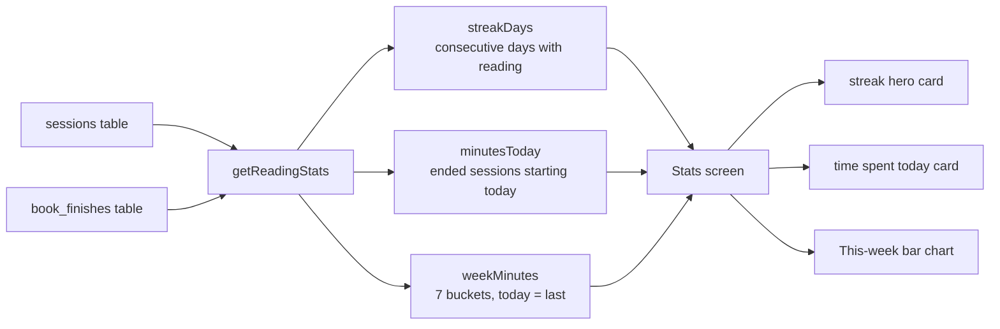
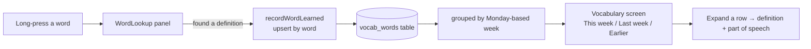
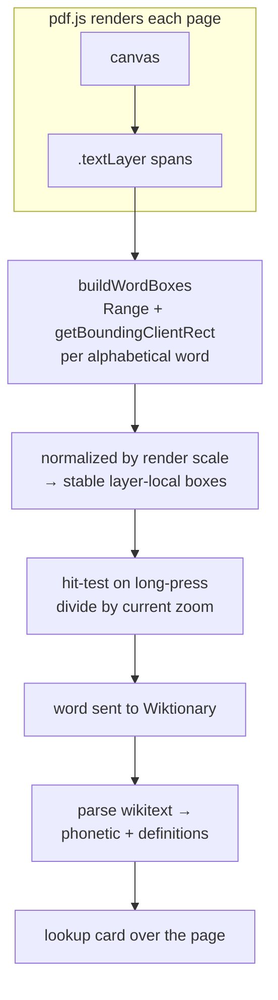
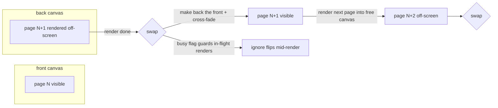
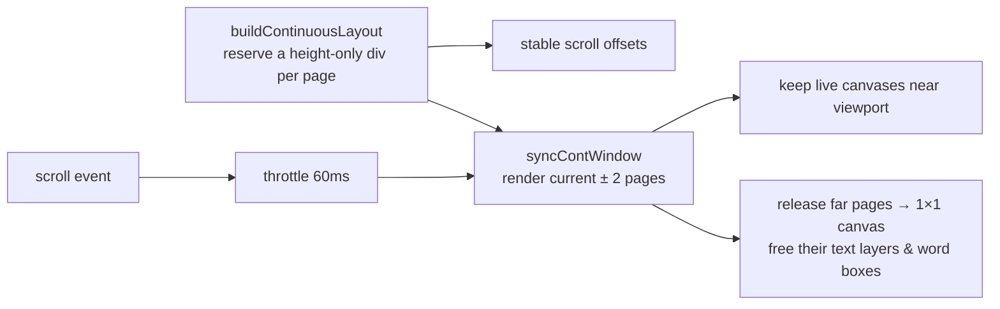
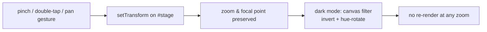
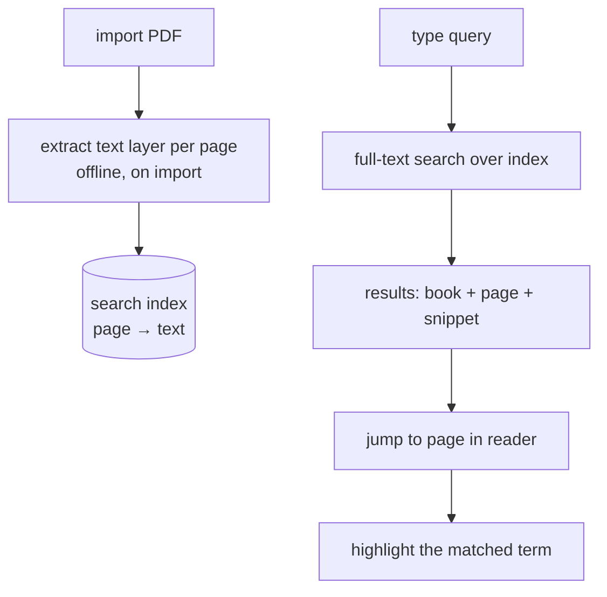
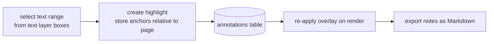
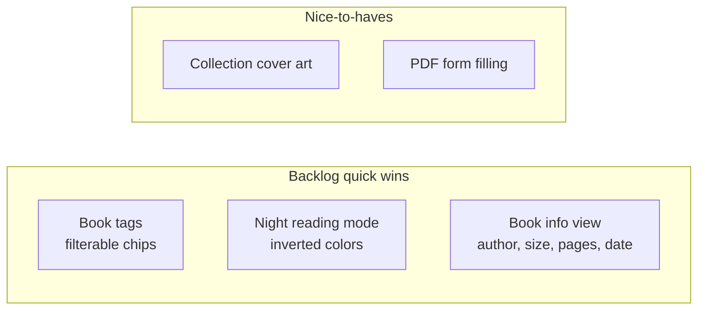

# Lumio 📚

A native PDF reader built with [Expo] and React Native, featuring a personal library, reading progress tracking, reading statistics, a saved vocabulary, and a webview-based reader. Its standout feature is **on-the-spot word lookup** — long-press any word to find its meaning without leaving the page.

## The search-for-meaning experience

Lumio turns your PDF into a look-up-anywhere reading surface. Unlike a dictionary app or a separate browser tab, the meaning is one long-press away:

- **Long-press any word, get its meaning instantly** — no switching screens, no breaking your reading flow.
- **Hit-testing built on the actual rendered text layer** — word boxes come from the PDF's own text geometry, so the word you press is exactly the word that's highlighted. No OCR guesswork.
- **Works in both reading layouts** — word lookup is just as precise in Continuous scroll as it is in Single page, even when you're zoomed in.

- **Clean, dismissible lookup card** — the result slides up over the page and closes with a tap.

## Features

- **Instant word lookup** — long-press any word to search for its meaning, powered by the PDF's real text layer.
- **Vocabulary** — every word you successfully look up is saved automatically and reviewable on a dedicated screen, grouped by week (This week / Last week / Earlier).
- **Reading stats (gamified)** — reading sessions are tracked automatically (started when a book opens, closed when it backgrounds) and turned into a daily **streak**, time spent today, and a "this week" bar chart.
- **Library management** — import PDFs from your device, sort (recent / A–Z / Z–A), rename, remove from library, or delete permanently.
- **Collections / bookshelf** — organize books into collections.
- **Bottom navigation** — Library / Stats / Vocabulary, one tap apart.
- **Reader** — a native WebView-powered PDF reader (pdf.js) with:
   - Pinch-to-zoom, single-finger pan while zoomed, and double-tap zoom.
   - Swipe between pages; tap-to-flip; page controls with progress saving.
   - **Layout modes** — Single page or Continuous scroll, toggled from the reader menu and persisted across sessions.
   - Light / dark reading modes, including an in-reader override.
   - Auto-captured book thumbnails.
- **Progress tracking** — your reading position is saved per book and resumed on open.

## Gamified reading stats

Reading is turned into a game you can win daily. The app doesn't just save your page — it records *when* you read, then motivates you with a **streak** (read any day and your streak grows; miss a day and it resets), a **daily time total**, and a **weekly bar chart** showing your effort over the last seven days.

Every time you open a book, Lumio starts a **reading session**. The session stays open while you read and is closed the moment you leave the reader or background the app — so idle background time is never counted as reading:



Reaching the final page also records a **book finished** milestone (once per book). Those raw events are then aggregated into the numbers the Stats screen shows — days-with-reading feed the streak, and every ended session's minutes are bucketed into the last 7 days for the chart:



The streak has a forgiving rule: if today has no reading yet, it still counts from yesterday — a day-off doesn't break your run until a full day has gone by. All aggregation is derived from raw session rows, so the numbers always reflect reality the moment a session closes.

## Vocabulary

Every word you look up successfully (one that returns a real definition) is saved automatically to a **vocabulary list**, reviewable on its own screen, grouped by week:



Looking up the same word again refreshes its timestamp (bumping it to the top) instead of creating a duplicate. A bottom navigation bar — Library / Stats / Vocabulary — keeps every screen one tap away.

## Unique features at a glance

Most PDF readers just render pages. Lumio's distinctive engineering lives in a few features that are easy to take for granted but hard to build — here's how each one works:

### Pixel-accurate word lookup (no OCR)

Word boxes come from the PDF's own text layer geometry, not from guessing at coordinates:



Because boxes are zoom-normalized when built and divided by the *current* zoom at lookup time, a long-press is precise in Single page and Continuous scroll alike, at any zoom.

### Double-buffered page turns

pdf.js rendering is slow enough to flash blank between pages. Two stacked canvases hide that latency:



The cross-fade makes turns smooth, and the `busy` flag drops flips that arrive mid-render so the two canvases never fall out of sync.

### Continuous scroll that doesn't melt memory

A 600-page book at full resolution would exhaust GPU memory, so the scroll layout reserves every page but renders only a window around the reader:



### Zoom & pan without re-rendering

Pinch, double-tap, and one-finger pan all transform a single CSS stage — pdf.js never re-renders:



Dark mode is a CSS filter on the canvas element itself, so it composes correctly under the transform and never needs a re-render — even mid-zoom.

## Features worth adding next

The backlog has some high-value additions. Here's how I'd design the two most impactful ones, plus the quick wins:

### Full-text search across books

Reading a PDF and forgetting which book it was in is common. Search should index text on import and let you jump straight to the hit:



### Highlights & notes (annotations)

The text layer already gives precise word positions — the same geometry can anchor highlights that survive page renders:



### Quick wins from the backlog



## Tech stack

- [Expo SDK 57](https://docs.expo.dev/versions/v57.0.0/)
- [Expo Router](https://docs.expo.dev/router/introduction/) (file-based routing)
- [pdf.js](https://mozilla.github.io/pdf.js/) rendered inside a `react-native-webview`
- [expo-file-system](https://docs.expo.dev/versions/v57.0.0/sdk/filesystem/) for storage
- [expo-sqlite](https://docs.expo.dev/versions/v57.0.0/sdk/sqlite/) for the library/progress/stats/vocabulary database
- TypeScript, `react-native-reanimated`, `expo-symbols`

## Get started

1. Install dependencies

   ```bash
   npm install
   ```

2. Start the app

   ```bash
   npx expo start
   ```

   In the output, you'll find options to open the app in a
   - [development build](https://docs.expo.dev/develop/development-builds/introduction/)
   - [Android emulator](https://docs.expo.dev/workflow/android-studio-emulator/)
   - [iOS simulator](https://docs.expo.dev/workflow/ios-simulator/)
   - [Expo Go](https://expo.dev/go), a limited sandbox for trying out app development with Expo

## Project structure

```
src/
├── app/                  # Expo Router screens (library, reader/[id], stats, vocab)
├── components/
│   ├── brand/            # Brand header, loader
│   ├── library/          # Book cards, empty states, sort control, bottom menu
│   ├── reader/           # PdfViewer (WebView), header, page controls, word lookup
│   └── theme-*.tsx       # Themed primitives
├── constants/theme.ts    # Colors, spacing, fonts
├── context/              # Theme mode context
├── hooks/                # useTheme, useColorScheme
└── lib/                  # Library, progress/stats/vocab DBs, types
```

## Linting

```bash
npx expo lint
```

Note: ESLint must be installed (`npm install -D eslint eslint-config-expo`) before linting works in a fresh checkout.

## Learn more

- [Expo documentation](https://docs.expo.dev/)
- [Expo Router](https://docs.expo.dev/router/introduction/)
- [pdf.js](https://mozilla.github.io/pdf.js/)
